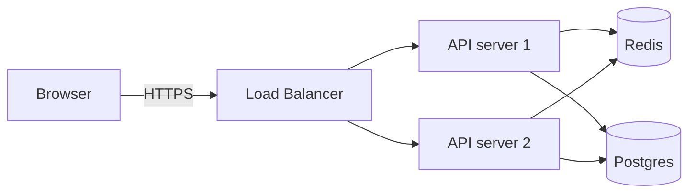

# Visuals (Claude-native)

Vector-only visual generation using Claude's text output. Three formats: **SVG**, **Mermaid**, and **ASCII**. No external services, no API keys.

## When to use

Trigger when the user asks for any of:

- A **diagram** — architecture, flow, sequence, ER, mind-map, deployment, network.
- A **chart** with simple/static data — bar, pie, line, sparkline. (Real data viz with interactivity → use `d3-viz`.)
- A **simple icon or logo** — geometric shapes, letterforms, glyphs.
- An **illustration in a flat / geometric / line style** — wireframes, schematics, abstract diagrams.
- A **terminal-friendly diagram** — ASCII art for READMEs, CLI output, code comments.
- "Visualize X", "draw X", "sketch X", "show me a diagram of X".

Do **not** trigger for:

- Photorealistic images, concept art, AI illustrations of people/places/products → no Claude path; user needs an external image-gen API (Flux, DALL-E, SD).
- Image *enhancement* or upscaling → use `image-enhancer`.
- Heavy data visualizations with interactivity, transitions, or large datasets → use `d3-viz`.
- Designed posters or art-philosophy-driven pieces → use `canvas-design`.
- Slide decks → use `frontend-slides`.

If the user's intent is ambiguous (icon vs. photo? diagram vs. illustration?), ask one clarifying question before generating.

## Format choice

| Need | Format | Why |
|------|--------|-----|
| Flowchart, sequence, ER, gantt, state machine, mindmap | **Mermaid** | Declarative, renders on GitHub/Notion/most viewers. |
| Architecture diagram (boxes, arrows, custom layout) | **SVG** if layout matters; **Mermaid** if standard | SVG when you need pixel control. |
| Custom icon, logo, glyph | **SVG** | Vector, scalable, editable. |
| Simple chart with hand-coded data | **SVG** or **Mermaid** (`xychart-beta`) | SVG for full control. |
| Terminal doc / README inline / chat output | **ASCII** | No rendering required. |
| Mathematical / scientific figure | **SVG** | Vector, precise. |

When in doubt, prefer Mermaid for diagrams (cheaper, more compact, renders everywhere) and SVG for icons / custom layouts.

## Procedure

### 1. Classify the request

Sort into one of: **diagram**, **chart**, **icon**, **illustration**, **ASCII sketch**. If it's clearly out of scope (photoreal, concept art), say so plainly and recommend an external tool.

### 2. Pick the output format

Use the table above. If you pick SVG, decide: save to file (`~/Downloads/<slug>.svg`) or return inline (small icons, or when the user is iterating).

### 3. Plan the structure (briefly, internally)

Before writing markup, sketch:

- **Dimensions**. Default SVG `viewBox="0 0 800 600"` for diagrams, `0 0 64 64` for icons, `0 0 1024 256` for sparklines.
- **Palette**. Default to a small accessible palette: `#0f172a` (slate-900) text, `#3b82f6` (blue-500) primary, `#10b981` (emerald-500) accent, `#ef4444` (red-500) warn, `#f8fafc` (slate-50) background. Don't invent novel colors per request unless asked.
- **Layout**. Estimate node positions, label widths, spacing. For diagrams with > 6 nodes, prefer Mermaid (auto-layout) over SVG (hand-positioned).
- **Typography**. Default `font-family="ui-sans-serif, system-ui, sans-serif"`, `font-size="14"`. Center labels with `text-anchor="middle"` and `dominant-baseline="middle"`.

### 4. Generate

#### SVG

Write a complete, well-formed SVG document. Always include `xmlns="http://www.w3.org/2000/svg"` and an explicit `viewBox`. Prefer `<g>` grouping with `transform` over per-element absolute coordinates. Use `<title>` and `<desc>` for accessibility.

Keep total path/element count under ~150 unless the visual genuinely needs more — large hand-coded SVGs are hard to debug and easy to mis-coordinate.

Common patterns:

- Boxes: `<rect>` with rounded corners (`rx="8"`).
- Arrows: define one `<marker>` for arrowheads, reuse on every line.
- Labels: place after the shape, use `text-anchor="middle"`.
- Layered design: background → connectors → boxes → labels.

#### Mermaid

Use the appropriate diagram type (`flowchart`, `sequenceDiagram`, `classDiagram`, `erDiagram`, `stateDiagram-v2`, `gantt`, `mindmap`, `xychart-beta`). Lead with the type declaration. Comment intent above complex sections with `%%`.

Wrap in a fenced ```mermaid block so the user can paste into any Markdown renderer.

#### ASCII

Use Unicode box-drawing where it improves legibility (`─ │ ┌ ┐ └ ┘ ├ ┤ ┬ ┴ ┼ → ↓ ←`). Align with monospace assumption. Cap width at 80 columns unless the user has explicitly asked for wider.

### 5. Save or return

- **Save SVG**: write to `~/Downloads/<slug>.svg` with a slug derived from the request. Confirm path in your response.
- **Return Mermaid / ASCII inline**: in a fenced code block. Don't save these to a file unless asked.
- **Save Mermaid to file**: only when the user has asked for a `.md` deliverable that includes the diagram, or wants a `.mmd` file for separate rendering.

### 6. Self-check

Before reporting completion:

- **SVG**: parses as XML. Run `python3 -c "import xml.etree.ElementTree as ET; ET.parse('path.svg')"` if the file is non-trivial.
- **SVG dimensions**: `viewBox` matches the content extents (no large empty regions, no clipping). Quick check by eyeballing min/max coordinates.
- **Mermaid**: type declaration is on the first line; node IDs don't collide with reserved words (`end`, `class`, etc.); each edge references a defined node.
- **ASCII**: every row has the same character width; box characters connect correctly.
- **Accessibility**: SVG has `<title>` (and `<desc>` for non-trivial diagrams). Mermaid uses real labels, not abbreviations only the author understands.

Report: file path (if saved), brief description of what's in it, and any caveats.

## Examples

### Architecture diagram (Mermaid)



### Custom icon (SVG)

```svg
<svg xmlns="http://www.w3.org/2000/svg" viewBox="0 0 64 64">
  <title>Music note</title>
  <circle cx="20" cy="48" r="8" fill="#3b82f6"/>
  <rect x="26" y="12" width="3" height="36" fill="#3b82f6"/>
  <path d="M29 12 Q44 14 44 24 Q44 18 29 22 Z" fill="#3b82f6"/>
</svg>
```

### ASCII state machine

```
  ┌──────┐  start   ┌─────────┐  ack    ┌────────┐
  │ idle │ ───────► │ pending │ ──────► │  done  │
  └──────┘          └─────────┘         └────────┘
                       │
                       │ timeout
                       ▼
                   ┌─────────┐
                   │  error  │
                   └─────────┘
```

## Anti-patterns

- **Don't try photorealism**. SVG can't, ASCII can't, Mermaid can't. Tell the user this skill doesn't fit and recommend an external image-gen API.
- **Don't hand-code SVG charts when matplotlib will do**. For a chart with > 20 data points, write a 5-line Python snippet via `Bash` that runs matplotlib and saves a PNG — much faster, more accurate, prettier.
- **Don't invent fake data** for charts. Ask the user for the data, or use Mermaid's `xychart-beta` with the user's actual numbers.
- **Don't generate 500-line SVGs**. If the diagram is that complex, switch to Mermaid (auto-layout) or admit you should be using a real diagramming tool.
- **Don't use random hex colors per request**. Stay within the default palette unless the user has specified one. Consistency makes outputs feel intentional.
- **Don't return inline base64 PNG**. The whole point of this skill is text-native vector output. If raster is needed, that's outside scope.
- **Don't skip `<title>` and `<desc>`**. They're tiny and they're how screen readers and bots understand the SVG.

## Quick reference

| Step | Tool | Notes |
|------|------|-------|
| Classify | (Claude reasoning) | Diagram / chart / icon / illustration / ASCII / out-of-scope. |
| Pick format | (Claude reasoning) | See format table. |
| Generate SVG | `Write` | Save to `~/Downloads/<slug>.svg` by default. |
| Generate Mermaid | inline fenced block | Don't save unless asked. |
| Generate ASCII | inline fenced block | Use Unicode box-drawing. |
| SVG validation | `Bash` (`xml.etree.ElementTree`) | For non-trivial files. |
| For real chart data | `Bash` (Python + matplotlib) | When > 20 points or stats needed. |

## Known gaps

This skill explicitly does not cover:

- Photorealistic images, concept art, character art, scenes — no Claude-native path.
- Animated graphics (use HTML/CSS via `artifacts-builder`, or Lottie via a separate tool).
- Heavy interactive data viz — use `d3-viz`.
- Image editing / retouching — use `image-enhancer` or external tools.

For any of these, the honest answer is: this skill won't help; you need a different tool.
